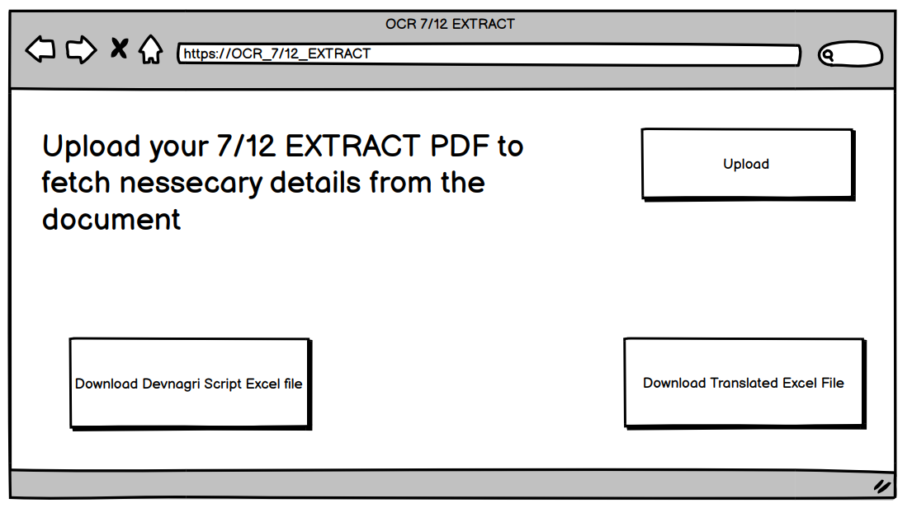
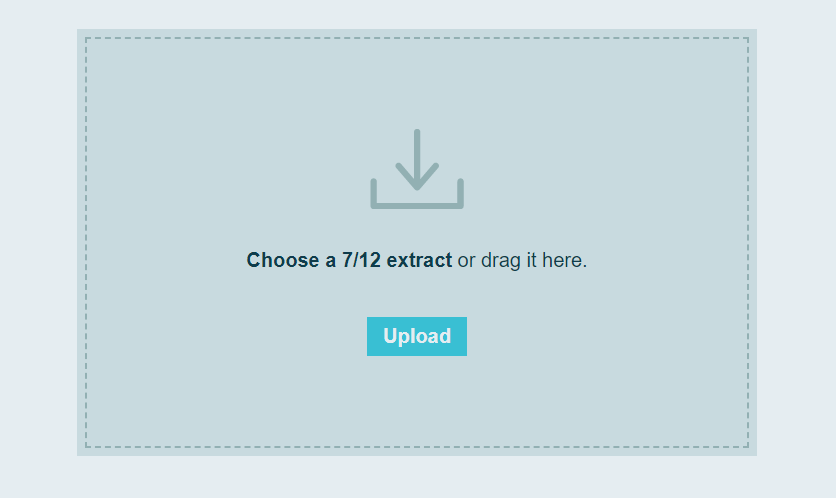
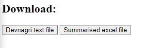
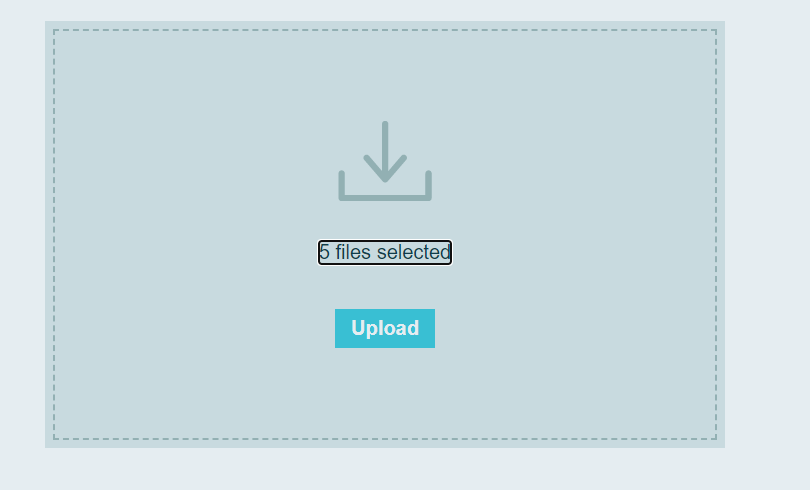
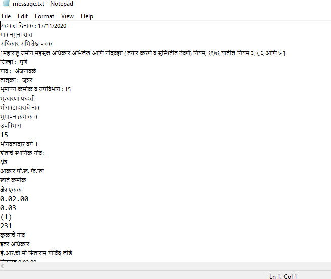
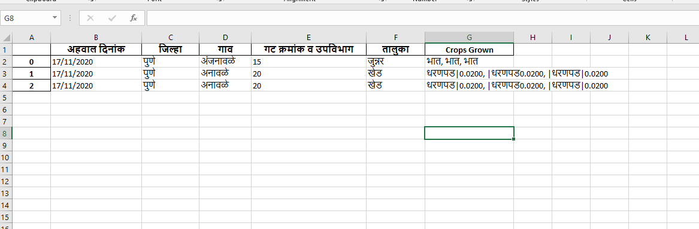

# Saath Baara Utara OCR, The 7/12 OCR

## By X Æ A-3

 

>This projectis aimed at helping the **Global Parli Foundation** in their mission to improve rural India through a replicable model of Rural Rejuvenation.

In order to achieve this we aim to
  - build a hosted OCR web service
  - which converts the 7/12 extract (“Saath Baara Utara”) 
  - to an editable excel file.

## Detailed Documentation in ppt
[PPT](DOCS/401_Jay_Jhaveri_abstract.pptx)

## Basic Prototype

## Final Design

### Temp download page(IN PROGRESS)

# Our Features!

  - Upload singular or multiple Saath Baara Utara pdfs at once using drag and drop or browse.
   
  - Google ocr converts each of these files to a text document in devnagri script
   
  - Using pandas and python we extract usefull information from these converted text. Basically, we extract variables from the text documents and create columns for a excel file based on them for easy readability and comparision between multiple 7/12 Extracts.
   
 
# Advantages!
 - In our opinion the biggest advantage we provide is the multiple file support => EXCEL as this will be helpfull for the NGO to compare thousands of 7/12 extracts at a glance using excel functionalities. 
 - Our next advantage would be fast and reliable OCR service, with a error rate of only 1.2 %.
 - No one in the market currently provide all these functionalities bundled together.

# To be done by tommorow: 
 - working of the django download button on the final output screen.
